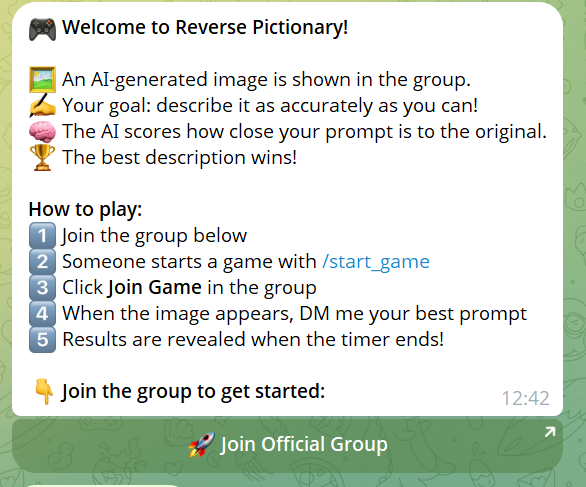
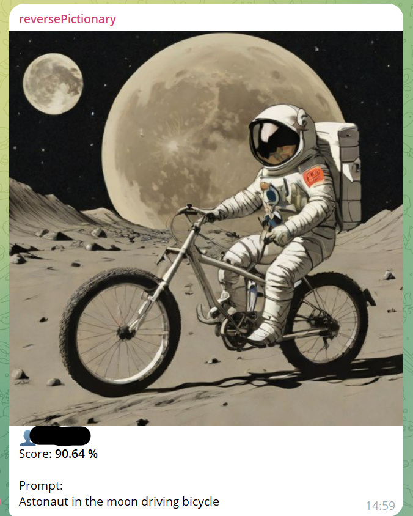
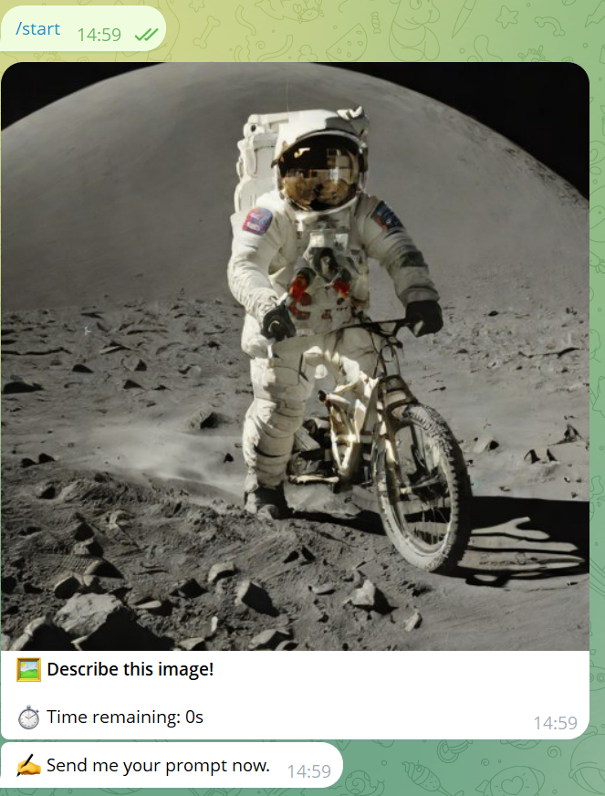
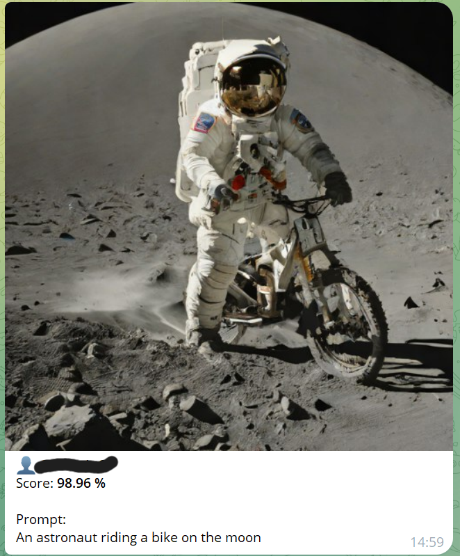
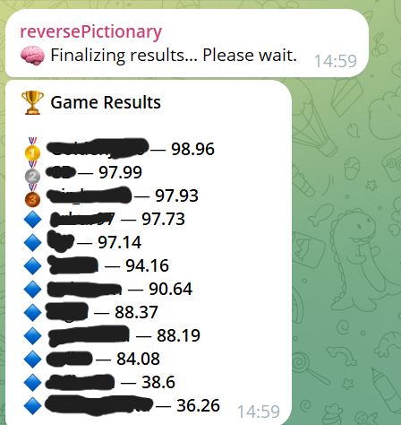

# 🤖 Prompt Battle

## 👥 The Team
* 👨‍💻 **Nir Hazan**
* 👩‍💻 **Gavriela Michael**
* 👨‍💻 **Solomon Asmr**

---

## 📖 About This Bot
### 🎨 Reverse Pictionary Bot
An interactive Telegram-based game where players compete to reverse-engineer AI images. Instead of drawing, players use their linguistic and descriptive skills to match the AI's original prompt using semantic similarity scoring.

## 🖼️ Screenshots

### Lobby & Game Start


### Game in Progress


### AI Generated Image Example


### Player Submissions


### Results & Similarity Scoring


---


## 📝 Game Mechanics

The **Reverse Pictionary Bot** challenges players to look at an AI-generated image and guess the exact text prompt that created it. It bridges the gap between group social gaming and modern AI capabilities.

### 🎮 How It Works
1. **🕒 Lobby Phase**: A game is initiated in a group. Players have **30 seconds** to join via an interactive button.
2. **🖼️ The Challenge**: The bot posts a unique AI-generated image to the group.
3. **🤫 Private Guessing**: To prevent "answer stealing," players use a **deep-link button** to submit their guesses privately to the bot's DMs.
4. **🧠 AI Evaluation**: The bot compares player prompts against the master prompt using a **Semantic Similarity API**.
5. **🏆 The Reveal**: The bot generates images based on the players' actual guesses and announces the winner in the group with a gallery of the results.

---

## ✨ Key Features
* **🚫 Anti-Spam Control**: Logic to prevent concurrent games and strictly enforce one guess per player.
* **⌛ Live Timers**: Real-time countdowns for both joining and guessing phases (updated every second).
* **🔗 Deep-Linking**: Seamless transition from Group Chat to Private DM for secret submissions.
* **🎭 Visual Feedback**: Players see their own prompts rendered as new images, providing a hilarious "Expectation vs. Reality" comparison.

---

## 🚀 Getting Started

### 🔗 Try the Bot
Join the fun here: [Guess The Prompt](https://t.me/reverse_pictionary_bot)

---

## 🛠️ Instructions for Developers 

### 📋 Prerequisites
* ⚡ [uv](https://docs.astral.sh/uv/getting-started/installation/) (uv will automatically manage your Python installation!)

### ⚙️ Setup
   **Clone the repository and run**
   ```bash
   uv run bot.py
